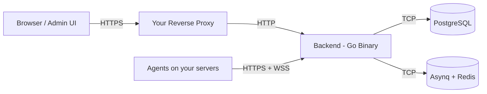

<div align="center">

# PatchMon


## Fork information
This fork is a branch of the original with some of the pull requests originating from there applied (Alpine support, etc).

This fork is under development, and not considered stable. We have made some modifications to the update checker and workflows, meaning that the checks do not point to the original PatchMon service.


### Enterprise-grade Linux patch & server management platform

[](https://patchmon.net)
[](https://patchmon.net/cloud)
[](https://patchmon.net/discord)
[](https://github.com/PatchMon/PatchMon)
[](https://github.com/orgs/PatchMon/projects/2)
[](https://patchmon.net/docs/)

[](https://github.com/PatchMon/PatchMon/releases)
[](https://github.com/PatchMon/PatchMon/stargazers)
[](LICENSE)
[](AI-DECLARATION.md)

</div>

---

## What is PatchMon?

PatchMon is an enterprise-grade platform that gives operations teams a single pane of glass to monitor, patch and secure their Linux fleet, with FreeBSD and Windows agent support.

A lightweight agent communicates outbound-only to the PatchMon server on your schedule - no inbound ports required on monitored hosts - delivering real-time visibility into package health, compliance posture and system status across environments of any scale.


---

## Why PatchMon?

- **Outbound-only agents** - no inbound firewall changes, no SSH or WinRM exposure, no VPN required.
- **Single binary, bundled UI** - one Go binary with the React frontend embedded. One container, no Node runtime at deploy time.
- **Open source, with a managed cloud** - AGPL v3 licensed, free to self-host. Production hosting available at [patchmon.net/cloud](https://patchmon.net/cloud).
- **Multi-OS by design** - Linux (apt, dnf, yum, apk, pacman), FreeBSD (pkg) and Windows, handled by the same agent and control plane.

---

## Quick Start

Docker is the fastest way to try PatchMon:

```bash
mkdir patchmon && cd patchmon
bash -c "$(curl -fsSL https://raw.githubusercontent.com/PatchMon/PatchMon/refs/heads/main/docker/setup-env.sh)"
docker compose up -d
```

Open `http://localhost:3000`, create an admin user, add a host in the UI and copy the generated install command onto the target server.

Full deployment options (Docker manual, Proxmox LXC, PatchMon Cloud) are in the [Deployment](#deployment-options) section.

---

## Features at a Glance

### Patch Management

The core of PatchMon - orchestrate updates across your fleet with validation, approval and live visibility.

| Capability | What It Does |
|---|---|
| **Dry-Run Validation** | Preview the exact package transaction on a host before anything touches production. Every run captures the full plan so you know what would change. |
| **Approve & Execute** | One-click approval turns a validated dry-run into a real patch run, with a per-host audit trail of who approved what and when. |
| **Scheduled Patching** | Patch policies decide when updates apply - immediate, maintenance window or delayed rollout. Approve now, execute later. |
| **Live Patch Streaming** | Watch patch execution in real time from the browser. Agent stdout/stderr is streamed over WebSocket, with the ability to stop a run mid-flight. |
| **Selective Patching** | Target specific packages, security-only updates or a full upgrade. Works across apt, dnf, yum, apk, pacman and FreeBSD pkg. |
| **Patch History & Audit** | Full searchable history of every run - exit code, duration, packages touched, approver and host. |


### Visibility & Inventory

| Capability | What It Does |
|---|---|
| **Personalised Dashboard** | Per-user, drag-and-reorder overview cards showing fleet health, outdated packages, host status and patching activity at a glance. |
| **Host Inventory** | Browse every enrolled server with OS, uptime, kernel, last check-in and group membership. |
| **Package Inventory** | View every installed package across your fleet, filter to outdated or vulnerable ones, and see exactly which hosts need attention. |
| **Repository Tracking** | Every APT / YUM / DNF / APK / pacman repository configured on each host, in one place. |
| **Docker Monitoring** | Automatic discovery of containers, images, volumes and networks with real-time status pushed over WebSocket. |

### Security & Compliance

| Capability | What It Does |
|---|---|
| **Compliance Scanning** | Run OpenSCAP CIS Benchmarks and Docker Bench for Security. Track compliance scores over time with rule-level results and remediation guidance. |
| **Alerting** | Host-down, pending server updates and agent-update alerts. Filter by severity, type and status; assign to team members. |
| **Outbound-Only Agent** | No inbound ports on monitored hosts. Agent initiates all traffic, with IP allow-lists for enrolment tokens and rate limiting on every endpoint. |
| **RBAC** | Multi-user accounts with fully customisable roles and granular permissions - every team member sees only what they need. |
| **OIDC Single Sign-On** | Authenticate with Authentik, Keycloak, Okta or any OIDC provider. Supports auto user provisioning, group-to-role mapping and SSO-only enforcement. |


### Access & Operations

| Capability | What It Does |
|---|---|
| **Web SSH Terminal** | Browser-based SSH to any host directly from the UI. Direct or proxy mode (route through the agent, no SSH port exposure). |
| **AI Terminal Assistant** | Built-in AI chat panel inside the SSH terminal for command suggestions, error diagnosis and context-aware help. Works with OpenRouter, Anthropic, OpenAI or Google Gemini. |
| **Branding & Theming** | Upload custom logos and favicon, choose colour themes and toggle light / dark mode per user. |


### Platform

| Capability | What It Does |
|---|---|
| **Integrations** | 33+ integrations including Proxmox LXC auto-enrolment, getHomepage, Ansible and more. |
| **REST API** | Full `/api/v1` with JWT authentication and interactive Swagger / OpenAPI docs at `/api-docs`. |

---

## Deployment Options

### PatchMon Cloud

> **14-day trial** at **[patchmon.net/pricing](https://patchmon.net/pricing)**

Fully managed PatchMon hosting with zero infrastructure overhead. We handle provisioning, updates, backups and scaling so you can focus on your fleet instead of the tooling behind it.

### Self-Hosted - Docker (Officially supported)

Docker is the preferred and supported self-hosted deployment. We use hardened images for security.

**Automated setup** from an empty directory. The setup script downloads `docker-compose.yml` and `env.example`, generates all required secrets, and walks you through URL and `CORS_ORIGIN` configuration interactively:

```bash
mkdir patchmon && cd patchmon
bash -c "$(curl -fsSL https://raw.githubusercontent.com/PatchMon/PatchMon/refs/heads/main/docker/setup-env.sh)"
docker compose up -d
```

Access the application at the URL you configured (default: `http://localhost:3000`).

**Manual Docker setup:** see [Installing PatchMon Server on Docker](https://patchmon.net/docs/patchmon-operator-guide#installing-patchmon-server-on-docker).

### Self-Hosted - Proxmox LXC

One-command LXC deployment via the [Proxmox VE Helper-Scripts](https://community-scripts.github.io/ProxmoxVE/scripts?id=patchmon) community script:

```bash
bash -c "$(curl -fsSL https://raw.githubusercontent.com/community-scripts/ProxmoxVE/main/ct/patchmon.sh)"
```

### Enrolling Hosts

Once the server is running:

1. Log in to the UI and add a host under **Hosts**.
2. PatchMon generates a one-line install command with a per-host API key.
3. Paste the command on the target server (requires root/sudo) and the agent enrols itself.

Supported agent platforms: Linux (amd64, 386, arm64, arm), FreeBSD (amd64, 386, arm64, arm), Windows (amd64, 386, arm64).

### Minimum Server Specs

| Resource | Requirement |
|----------|-------------|
| CPU | 2 vCPU |
| RAM | 2 GB |
| Disk | 15 GB |

---

## Architecture

| Component | Technology |
|-----------|-----------|
| Backend | Go, sqlc, chi router |
| Frontend | React + Vite, embedded in the `patchmon-server` binary |
| Database | PostgreSQL 17 |
| Queue | Redis 7 (Asynq) |
| Agent | Go binary - Linux, FreeBSD, Windows |



Agents initiate all communication. HTTPS carries reports and config; WSS (WebSocket over TLS) carries real-time events such as live patch streaming and Docker status.
Ensure that **Websockets** is supported by your proxy when passing the traffic to PatchMon container :3000 or whichever port you decide to use.

---

## Documentation

Full documentation at **[patchmon.net/docs](https://patchmon.net/docs)**.

| Topic | Link |
|-------|------|
| Installing on Docker | [Docker install guide](https://patchmon.net/docs/patchmon-operator-guide#installing-patchmon-server-on-docker) |
| Environment variables | [Env vars reference](https://patchmon.net/docs/patchmon-operator-guide#patchmon-environment-variables-reference) |
| Integration API | [Integration API docs](https://patchmon.net/docs/patchmon-api-integrations-guide#integration-api-documentation) |
| Proxmox LXC auto-enrolment | [Proxmox guide](https://patchmon.net/docs/patchmon-api-integrations-guide#proxmox-lxc-auto-enrollment-guide) |
| getHomepage dashboard card | [getHomepage integration](https://patchmon.net/docs/patchmon-api-integrations-guide#gethomepage-dashboard-card) |
| Metrics collection | [Metrics info](https://patchmon.net/docs/patchmon-admin-guide#metrics-and-telemetry) |

---

## Support

### Community

- **Discord:** [https://patchmon.net/discord](https://patchmon.net/discord)
- **Email:** support@patchmon.net

### Professional & Enterprise

- **PatchMon PRO:** [https://patchmon.net/pro](https://patchmon.net/pro)

---

## Contributing

We welcome contributions from the community. See **[CONTRIBUTING.md](CONTRIBUTING.md)** for the full guide: code style, commit conventions, running tests, documentation workflow and the PR process.

Quick summary:

- Follow existing patterns and the Biome / golangci-lint configurations.
- Use conventional commit messages (`feat:`, `fix:`, `docs:`, etc.).
- Add tests for new features and ensure the full suite passes.
- Update documentation alongside code changes.

Good first issues are labelled in the [issue tracker](https://github.com/PatchMon/PatchMon/issues?q=is%3Aissue+is%3Aopen+label%3A%22good+first+issue%22).

---

## Roadmap

Track upcoming features and progress on the **[PatchMon Roadmap](https://github.com/orgs/PatchMon/projects/2)**.

---

## PatchMon PRO - Enterprise & Vendor Support

PatchMon is trusted by teams managing production infrastructure worldwide. We offer global vendor support and enterprise solutions tailored to your organisation's requirements.

| Offering | Details |
|----------|---------|
| **PatchMon Cloud** | Fully managed hosting - we handle infrastructure, updates, backups and scaling for you. |
| **Global Vendor Support** | Dedicated technical support available worldwide with SLA-backed response times. |
| **Custom Integrations** | Bespoke API endpoints, third-party connectors and tailored dashboards built to your specification. |
| **On-Premises / Air-Gapped** | Deploy in your own data centre or isolated environment with full support. |
| **White-Label Solutions** | Brand PatchMon as your own with custom logos, domains and theming, plus multi-context deployment options. |
| **Training & Onboarding** | Comprehensive team training and onboarding programmes for your organisation. |
| **Consulting** | Architecture review, deployment planning and migration assistance from the team that builds PatchMon. |

*Contact us at **support@patchmon.net** for enterprise and vendor support enquiries.*

---

## License

AGPL v3 - see [LICENSE](LICENSE) for details.
 
---

<div align="center">

**Made with ❤️ by the PatchMon Team**

This project represents hundreds of hours of development work. If PatchMon has saved you time or helped secure your infrastructure, a coffee would genuinely mean the world.

[](https://buymeacoffee.com/iby___)

> **⭐ If you find PatchMon useful, please star this repo - it helps others discover the project!**

[](https://patchmon.net)
[](https://patchmon.net/cloud)
[](https://patchmon.net/discord)
[](https://github.com/PatchMon/PatchMon)
[](https://patchmon.net/docs/)

</div>
